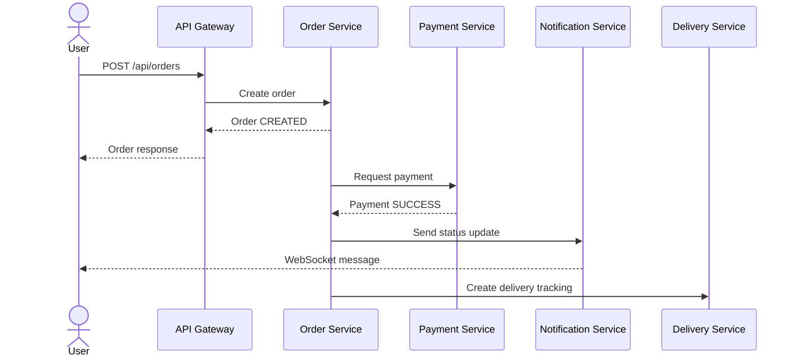

# Order Flow

```mermaid
sequenceDiagram
    actor User
    participant Gateway as API Gateway
    participant Order as Order Service
    participant Payment as Payment Service
    participant Notification as Notification Service
    participant Delivery as Delivery Service

    User->>Gateway: POST /api/orders
    Gateway->>Order: Create order
    Order-->>Gateway: Order CREATED
    Gateway-->>User: Order response
    Order->>Payment: Request payment
    Payment-->>Order: Payment SUCCESS
    Order->>Notification: Send status update
    Notification-->>User: WebSocket message
    Order->>Delivery: Create delivery tracking
```
